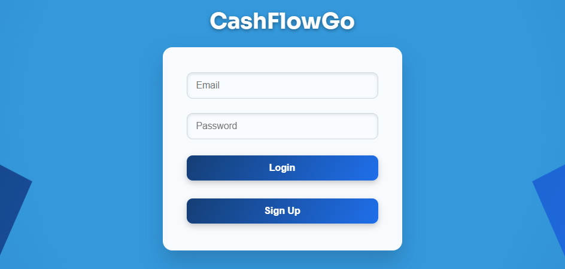
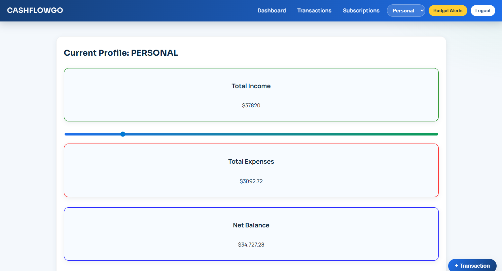
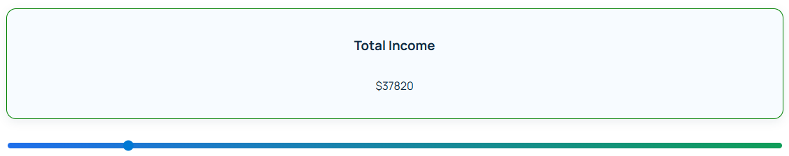
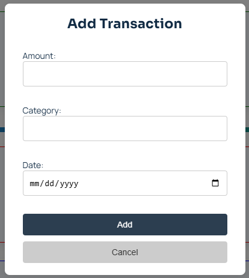
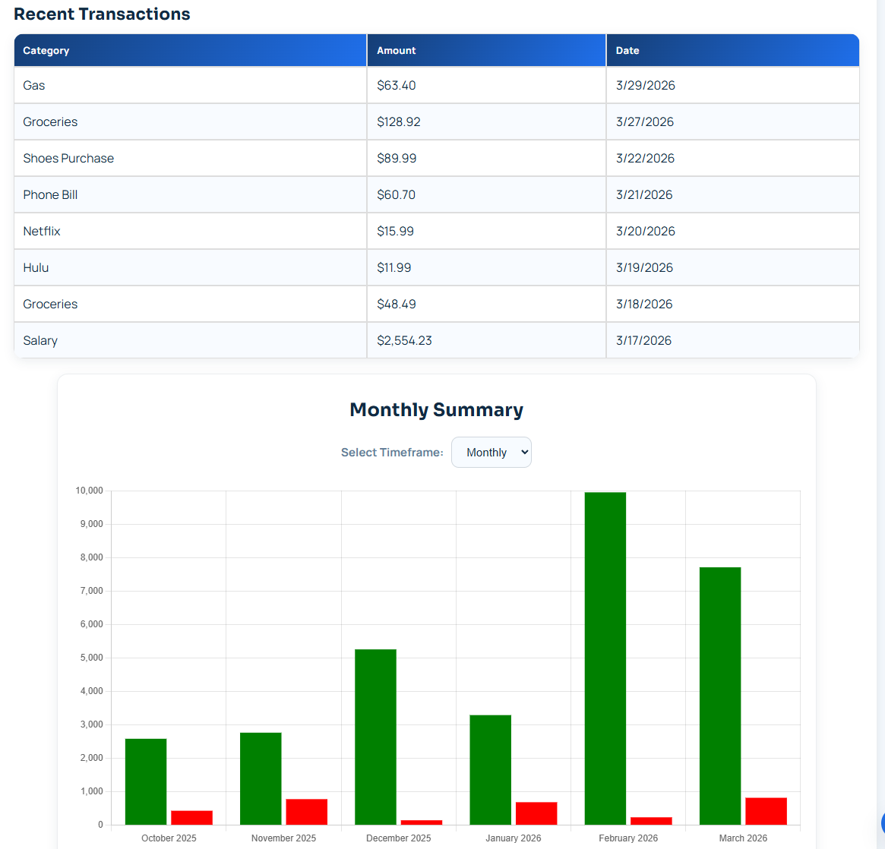
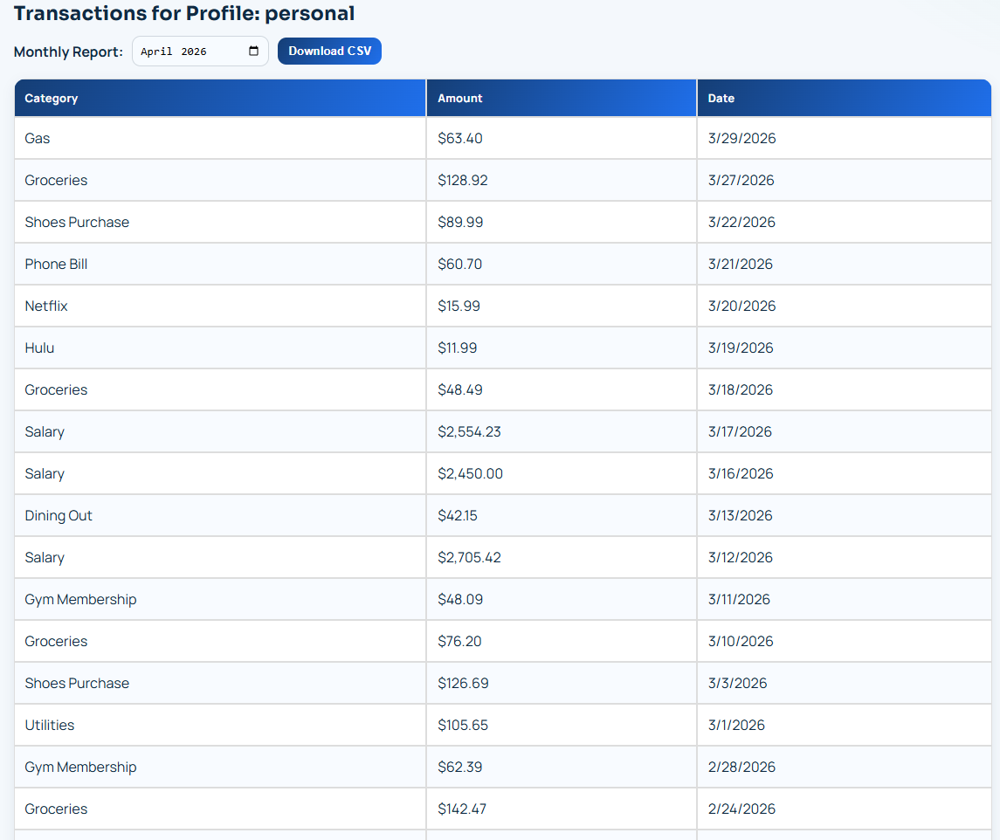
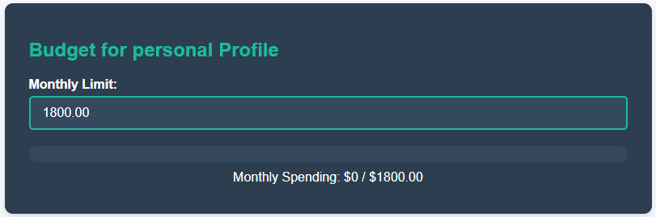
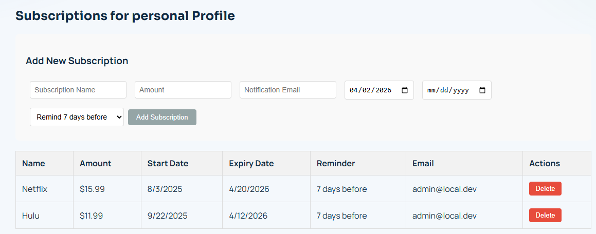

# CashFlowGo

CashFlowGo is a full-stack personal finance app built as a school project with React + Django.

It includes profile-based budgeting, transaction tracking, subscription management, and a local offline-capable frontend fallback for smoother development.

## Suggested GitHub Repo Description

`Full-stack personal finance app (React + Django) with profile-based budgeting, transaction tracking, subscription management, and offline-capable frontend fallback.`

## Features

- Account signup/login/logout with session auth
- Profile switching (`personal`, `business`, `family`)
- Add and view transactions by profile
- Income slider with per-profile adjusted income
- Budget limits with current spending progress
- Subscription CRUD with reminder hooks
- Local offline API fallback in frontend for API outage/dev scenarios

## Tech Stack

- Frontend: React, Axios, React Router, Chart.js
- Backend: Django, Django REST Framework
- Database: SQLite (local)

## Project Structure

- `src/` React frontend
- `accounts/`, `finances/`, `dashboard/` Django apps
- `cashflowgo/` Django project settings/urls/wsgi/asgi

## Local Setup

### 1) Clone and enter project

```bash
git clone <your-repo-url>
cd cashflowgo
```

### 2) Python environment

```bash
python3 -m venv .venv
source .venv/bin/activate
python -m pip install --upgrade pip
python -m pip install -r requirements.txt
python manage.py migrate
```

### 3) Frontend dependencies

```bash
npm install
```

### 4) Run app

```bash
npm run dev
```

Note:

- `npm run dev` starts frontend and attempts backend.
- Backend startup requires Django packages installed in your Python environment.

## Environment Variables

Create a local `.env` (or export variables in shell) based on `.env.example`.

Key vars:

- `DJANGO_SECRET_KEY`
- `DJANGO_DEBUG`
- `REACT_APP_ENABLE_OFFLINE_FALLBACK`
- `REACT_APP_EMAILJS_PUBLIC_KEY`
- `REACT_APP_EMAILJS_SERVICE_ID`
- `REACT_APP_EMAILJS_TEMPLATE_ID`

## Deployment

See [DEPLOYMENT.md](./DEPLOYMENT.md) for a step-by-step Cloudflare Pages + Render deployment guide.

## Core Flows Checklist

- Login and logout
- Add transaction
- Income slider updates income
- Budget updates and reflects current spending
- Add/delete subscriptions
- Profile switching updates dashboard data

## Screenshots

## Product Highlights

### Secure Sign In
Fast session-based login for personal, business, and family finance workflows.  


### Financial Snapshot at a Glance
Immediate visibility into income, expenses, and net balance on a single dashboard.  


### Adjustable Income Planning
Tune monthly income assumptions with a live slider to see real-time balance impact.  


### Rapid Expense Logging
Capture new transactions quickly with a lightweight modal flow.  


### Trends and Activity Insights
Monitor recent transactions and visual spending patterns in one place.  


### Monthly Report Export
Download profile-based monthly CSV reports for audit, sharing, or analysis.  


### Budget Monitoring
Set monthly limits and track spending progress to stay on target.  


### Subscription Management
Track recurring costs with profile-aware subscription records.  


## License

School/portfolio project. Add a license if you plan to open-source broadly.
